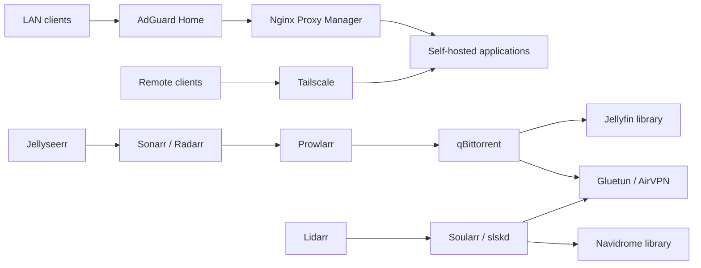

# Homelab Infrastructure

[](https://github.com/tilemachoscfu/homelab-infrastructure/actions/workflows/validate.yml)

A privacy-safe, reproducible Linux Mint homelab powered by Docker Compose.
It brings media automation, VPN-isolated downloads, smart-home services,
networking, monitoring and self-hosted data tools together without publishing
live credentials or personal data.

> [!IMPORTANT]
> This is a sanitized infrastructure reference, not a backup of the running
> host. Replace every placeholder locally before deploying anything.

## Highlights

- Download traffic isolated behind Gluetun and AirVPN
- Automated media requests, acquisition, subtitles and library management
- Local DNS and reverse-proxy access through the reserved `home.arpa` domain
- Health, disk and container monitoring
- Separate public templates and private runtime configuration
- Fail-closed secret scanning before every repository update

## Service map

| Area | Services |
| --- | --- |
| Media | Jellyfin, Jellyseerr, Sonarr, Radarr, Prowlarr, Bazarr |
| Music | Lidarr, Navidrome, slskd, Soularr |
| Downloads | qBittorrent, Gluetun, AirVPN |
| Network | AdGuard Home, Nginx Proxy Manager, Tailscale |
| Smart home | Home Assistant |
| Operations | Homepage, Uptime Kuma, Portainer, Netdata, Glances, Scrutiny |
| Data | Immich, Paperless-ngx, Vaultwarden, Kiwix |

## Architecture



See [the architecture guide](docs/architecture.md) for boundaries and request
flows.

## Repository layout

```text
.
├── stacks/                  Sanitized Compose templates
├── scripts/                 Export, validation and update tools
├── docs/                    Architecture and operations guides
├── .env.example             Safe environment-variable example
├── SECURITY.md              Security and disclosure policy
└── ROADMAP.md               Planned improvements
```

## Safe local use

```bash
git clone https://github.com/tilemachoscfu/homelab-infrastructure.git
cd homelab-infrastructure
cp .env.example .env
```

Replace all `CHANGE_ME` values in the local `.env`, review paths and ports, and
validate an individual stack before starting it:

```bash
docker compose -f stacks/<service>/compose.yaml config
docker compose -f stacks/<service>/compose.yaml up -d
```

The templates document this installation and may depend on directories or
services that are intentionally absent from the public repository.

## Security model

The repository intentionally excludes:

- passwords, API keys, tokens and private keys;
- WireGuard and AirVPN configuration;
- `.env` files, databases and live application state;
- media, photos, documents, downloads and backups;
- logs, public hostnames and Tailscale-specific hostnames.

Every update is checked locally and again by GitHub Actions. See
[SECURITY.md](SECURITY.md) before reporting a possible exposure.

## Maintainer workflow

```bash
./scripts/sync-from-live.py
./scripts/check-secrets.py
./scripts/update-repo.sh "Describe the homelab change"
```

The updater exports only allowlisted Compose files, replaces host-specific
values, scans the result, commits it and pushes it. A failed scan stops the
update.

## Contributing

Suggestions and carefully scoped improvements are welcome. Read
[CONTRIBUTING.md](CONTRIBUTING.md), browse the [roadmap](ROADMAP.md), or open an
[issue](https://github.com/tilemachoscfu/homelab-infrastructure/issues).
