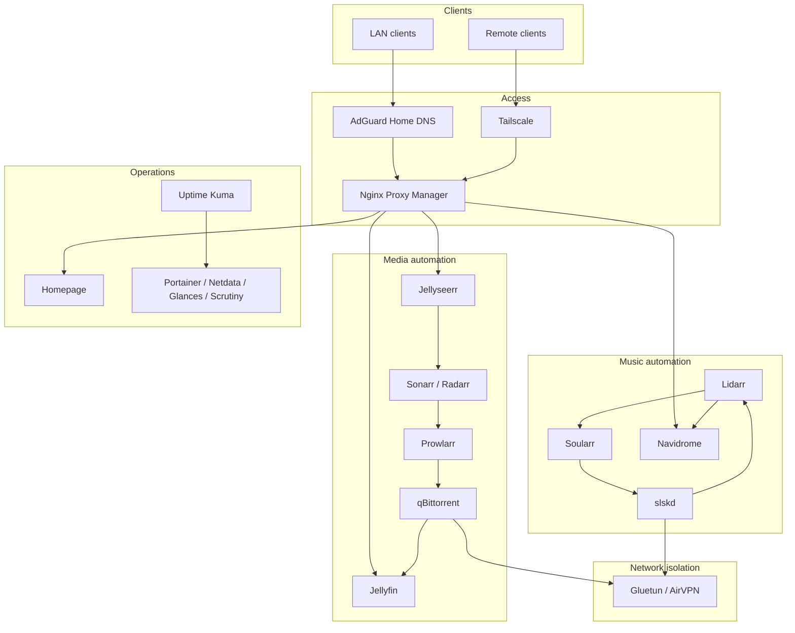

# Architecture

## Design goals

- Keep internet-facing and remote access paths explicit.
- Route downloader traffic through a healthy VPN network namespace.
- Separate public infrastructure templates from private runtime state.
- Keep media and irreplaceable personal data outside container configuration.
- Prefer small, reversible changes with validation and backups.

## System overview



## Request paths

Local application access follows:

```text
LAN client -> AdGuard Home -> Nginx Proxy Manager -> application
```

Approved remote access follows:

```text
Remote client -> Tailscale -> approved application endpoint
```

The public templates do not publish live hostnames or addresses.

## Media and music flows

```text
Jellyseerr -> Sonarr/Radarr -> Prowlarr -> qBittorrent -> Jellyfin
Lidarr -> Prowlarr/qBittorrent -> music library -> Navidrome
Lidarr wanted list -> Soularr -> slskd -> Lidarr import -> Navidrome
```

qBittorrent and slskd share Gluetun's network namespace. Gluetun must become
healthy before either downloader starts. If the VPN stops, its network boundary
prevents those download clients from silently falling back to the host route.

## Storage boundaries

| Data | Public Git repository | Private host/backups |
| --- | --- | --- |
| Sanitized Compose templates | Yes | Optional |
| Documentation and scripts | Yes | Optional |
| `.env` and credentials | Never | Yes |
| Databases and application state | Never | Yes |
| VPN configuration and keys | Never | Yes |
| Media, photos and documents | Never | Yes |
| Logs and generated caches | Never | Optional |

Compose templates use variables such as `${MEDIA_ROOT}` instead of personal
mount paths. Git history is not a replacement for tested data backups.
